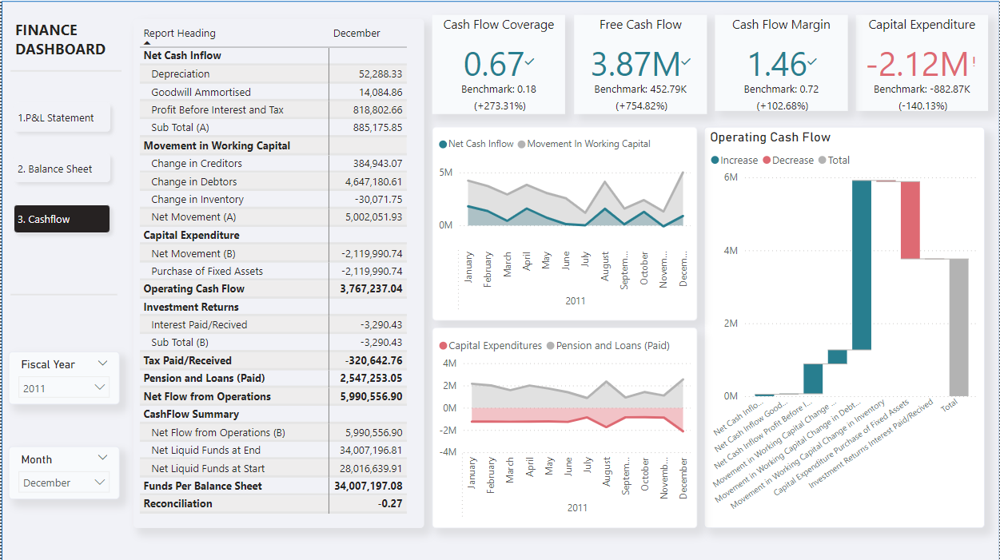

# **Velocron Financial Performance Report**

## **Project Background:**
Velocron, a global manufacturer of bicycles, has been undergoing financial analysis through its Profit and Loss (P&L), Balance Sheet, and Cash Flow statements for the fiscal period ending in December 2011. This report aims to provide a comprehensive understanding of the company's financial health, identify areas of strengths and potential concerns, and suggest further analysis to ensure sustainable business growth and optimal resource allocation.

The data examined include core financial metrics such as profitability, liquidity, working capital management, capital expenditure, cash flow performance, and debt obligations. By combining insights from the P&L statement, Balance Sheet, and Cash Flow statement, the report offers a holistic view of Velocron' financial operations and strategic positioning.

---
An interactive PowerBI dashboard can be downloaded [here](https://github.com/kelvindinhq/reward_program_marketing_analytic/tree/main/dashboard).  

## Data Structure and Initial Checks
The data was extracted from the company ERP in period of 2010 to 2013, in excels files, including 6 tables containing facts and dimension tables about the company financial and one Transaction table to record the company financial activities with a total row count of 110,484 records.  

The data then imported to PowerBI. To set up the format of the statements and also to change the furmular of calculation for future uses as needed, the stement table was created in excel to map the account to their proper heading in each statements.

Then, to connect data from the Transaction table to the right fiancial account, a bridge file was used with metadata to show range of acount maping to each report section.

Finally, using Powerquery to expand the maping of account from range to individuals accounts to map with the specific statement.

The end resutls is a connection of data in transactions maing to the exact account in the right statement.

## **Executive Summary:**

Overall, Velocron demonstrates a **strong financial position**, driven by high profitability, robust operational cash flow, and significant liquidity reserves. The company’s **Profit Before Interest and Tax (PBIT)** of **818.8K** reflects good profitability, while a healthy **cash inflow of 52.29K** from operations further supports financial stability. However, the report highlights **certain areas for concern**, such as a **4.65M increase in debtors**, indicating slower collections or extensive credit sales, and **substantial capital expenditure (CapEx)** of **-2.12M**, which exceeds industry benchmarks. 

However, some areas raise concern:
- **Increase in debtors** (4.65M), indicating slower collections or more generous credit terms.
- **Capital expenditure (CapEx)** of **-2.12M**, which is higher than industry benchmarks.

Despite these concerns, Velocron' **Current Ratio** of **1.61** and **Working Capital** of **19.52M** demonstrate liquidity, though both metrics fall short of their respective benchmarks. Additionally, the company's **Debt-to-Equity Ratio** of **2.87** reflects a more leveraged position, posing risks if profitability declines or interest rates rise.

---

## **Detailed Analysis:**

### **1. Profit and Loss Statement:**
- **PBIT**: **818.8K** – A strong indicator of profitability, reflecting operational efficiency.
- **Revenue Growth vs. Costs**: Efficient cost management contributes to the positive PBIT, though it’s crucial to assess whether this profitability can be sustained over time.
- **Interest Paid (-3.29K)** and **Tax Paid (320.64K)**: These are manageable, suggesting low financial pressure from external debt and tax obligations.
- **Depreciation**: **14.08K** – While a non-cash item, depreciation reflects capital asset utilization and is added back to the cash flow, demonstrating sound asset management.

### **2. Balance Sheet:**
- **Current Ratio**: **1.61** (Benchmark: **1.80**): Indicates sufficient liquidity, though the lower ratio may signal potential short-term financial stress under extreme conditions.
- **Working Capital**: **19.52M** (Benchmark: **73.83M**): While adequate for operations, this is far below the benchmark, raising concerns about the company’s capacity to fund growth and expansion.
- **Debt-to-Equity Ratio**: **2.87** (Benchmark: **2.11**): A higher-than-average leverage ratio signifies increased reliance on debt, which could lead to financial stress if profitability falters or borrowing costs rise.

### **Significant Movements**:
- **Debtors**: Increased by **4.65M**, reflecting slower payment cycles or more extensive credit sales. This can impact the cash conversion cycle and increase exposure to bad debts.
- **Creditors**: Reduced by **384.94K**, showing fewer payments outstanding to suppliers. While this indicates a stronger cash position, it could harm liquidity if inflows from receivables don’t keep pace.
- **CapEx**: **-2.12M** – This substantial capital investment exceeds industry benchmarks, reflecting a commitment to growth. However, this requires careful evaluation to ensure adequate returns on investment.

### **3. Cash Flow Statement**:
- **Net Cash Flow from Operations**: **5.99M** – A strong result indicating excellent cash generation from core business activities.
- **Capital Expenditure (CapEx)**: **-2.12M** – This reflects substantial investment in fixed assets, which, if managed well, could yield future growth. However, it is essential to monitor the impact of these investments on cash flow and profitability
- **Loans and Pension Payments**: **2.54M** – A significant outflow, suggesting a notable financial obligation toward loans and pensions. This may need further review to ensure that these payments don’t constrain future operations.

### **4. Cash Flow Ratios**:
- **Free Cash Flow**: **3.87M** – A positive indicator of liquidity, allowing for reinvestment, debt reduction, or shareholder returns.
- **Cash Flow Margin**: **1.46** (Benchmark: **0.72**): Indicates strong efficiency in converting sales into cash.
- **Cash Flow Coverage Ratio**: **0.67** (Benchmark: **0.18**): Demonstrates a strong ability to meet financial obligations with operating cash.

---

## **Abnormalities and Concerns**:
- **High Debtors (4.65M)**: The rise in receivables suggests looser credit terms or collection issues, which could negatively impact liquidity if not addressed.
- **Elevated Debt-to-Equity Ratio (2.87)**: Velocron' heavy reliance on debt makes it vulnerable to market fluctuations, especially if profitability declines or borrowing costs rise.
- **Capital Expenditure (2.12M)**: Large investments in fixed assets may be risky if they fail to generate expected returns, potentially straining future cash flow.

---

## **Recommendations for Further Analysis**:

### **1. Customer Payment Cycle Review**:
- Analyze **Accounts Receivable Aging** to ensure timely payments and mitigate bad debt risks. Adjusting credit terms or offering incentives for early payments could help improve cash flow.

### **2. CapEx ROI Evaluation**:
- Assess the **return on investment (ROI)** from the recent CapEx to ensure it contributes to future growth. Monitoring productivity gains or cost reductions from asset investments will help gauge the effectiveness of these expenditures.

### **3. Debt Management**:
- With a high **Debt-to-Equity Ratio**, reviewing the company’s **debt repayment schedule** and exploring refinancing options is crucial. Velocron must ensure it can meet future loan and pension obligations without straining operations.

### **4. Working Capital Efficiency**:
- Improve **working capital efficiency** by aligning inventory, receivables, and payables more closely. This will optimize liquidity and help close the gap between current performance and the industry benchmark.

### **5. Free Cash Flow Utilization**:
- Develop a strategy for utilizing **Free Cash Flow (3.87M)**. Velocron should explore options such as debt reduction, reinvestment in growth, or enhancing shareholder returns.

### **6. Benchmarking with Industry Peers**:
- Conduct a **comparative analysis** with competitors to evaluate how efficiently Velocron is managing its financial resources and identify areas where the company can improve.

---

## **Conclusion**:
Velocron is in a stable financial position, with strong profitability and positive cash flow. However, challenges such as managing debt and receivables must be addressed to maintain financial health and support future growth. By implementing the recommended analyses and strategic actions, Velocron can ensure long-term sustainability and optimal resource allocation.
